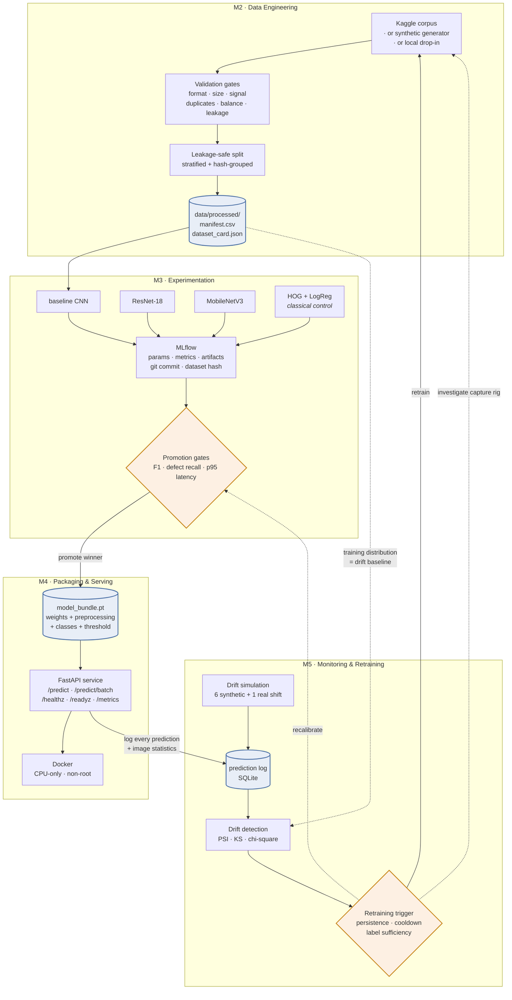

# DefectVision — Image-Based Defect / Quality Classifier

**Machine Learning Engineering (PCAM\* ZC412) · EC-1 Mini-Project · Flavor B**

An end-to-end ML **system**, not a model in a notebook: raw images enter a
validated and versioned data pipeline, several models compete under tracked
experiments, the winner is gated and promoted, served behind a REST API, and
then watched in production with drift detection and a documented retraining
policy.

> **Problem.** A quality-assurance team needs to flag defective submersible-pump
> impellers from images captured on the production line, and needs the system to
> keep working when the lighting, the camera, or the product mix changes.

---

## Contents

- [Results](#results)
- [Architecture](#architecture)
- [Quick start](#quick-start)
- [The pipeline, module by module](#the-pipeline-module-by-module)
- [API reference](#api-reference)
- [Design decisions](#design-decisions)
- [Repository layout](#repository-layout)
- [Documentation](#documentation)
- [Reproducing a run](#reproducing-a-run)
- [Testing](#testing)
- [Data and citation](#data-and-citation)

---

## Results

Dataset: **7,348 real casting images** (Kaggle *Casting Product Image Data for
Quality Inspection*), split 65/15/20 with near-duplicate grouping. All figures
below are measured, and every one is regenerated by the pipeline into
[`reports/`](reports/) — nothing here is hand-entered.

### Model comparison (test split, n = 1,457)

| model | params | test F1 | defect recall | p95 latency | throughput |
| --- | ---: | ---: | ---: | ---: | ---: |
| **baseline_cnn** ← promoted | 0.25 M | **0.9970** | 0.9952 | **2.79 ms** | 628 img/s |
| resnet18 | 11.17 M | 0.9964 | 0.9929 | 16.94 ms | 146 img/s |
| mobilenet_v3_small | 0.93 M | 0.9929 | 0.9905 | 9.42 ms | 569 img/s |
| logreg_hog *(classical control)* | 0.002 M | 0.9609 | 0.9620 | 5.14 ms | 280 img/s |

Two findings worth stating plainly:

**The classical control justifies the deep model.** HOG + logistic regression
reaches 0.961 F1 — respectable, and a real attempt rather than a straw man. The
~3.6-point F1 gap is the quantitative argument for a CNN, and without measuring
it "we used deep learning" would be an assumption.

**The 250 K-parameter CNN beat the 11 M-parameter ResNet.** Their bootstrap
intervals overlap almost entirely (0.9970 [0.9942, 0.9994] vs 0.9964 [0.9934,
0.9988]), so the test set cannot resolve a difference — but the baseline serves
**6× faster**. The promotion rule tie-breaks on latency inside the confidence
interval, so it selected the small model on merit, not by accident. On a
well-separated task, the ImageNet backbone bought nothing and cost throughput.

### Drift simulation (M5)

| scenario | max PSI | accuracy | acc. drop | mean confidence |
| --- | ---: | ---: | ---: | ---: |
| `baseline` *(control)* | 0.05 | 0.9950 | — | 0.989 |
| `focus_blur` | 12.43 | 0.9925 | +0.004 | 0.959 |
| `camera_angle` | 12.43 | 0.9400 | +0.057 | 0.963 |
| `new_variant` | 12.62 | 0.8375 | +0.159 | 0.927 |
| **`real_camera_upgrade`** *(real shift)* | 7.34 | 0.7800 | +0.217 | 0.972 |
| `sensor_noise` | 12.43 | 0.7425 | +0.254 | 0.910 |
| `lighting_bright` | 12.62 | 0.6100 | +0.387 | 0.970 |
| `lighting_dim` | 15.19 | 0.5775 | +0.419 | **0.996** |

**The headline finding is a silent failure.** Under `lighting_dim` the model's
accuracy collapses from 0.995 to 0.578 — while its mean confidence *rises* to
0.996. It is confidently, catastrophically wrong. Confidence monitoring alone
would have caught **1 of 7** degradations here; PSI against the frozen training
baseline caught **7 of 7**. That is the entire argument for monitoring the input
distribution rather than only the model's own certainty.

The `baseline` control sits at PSI 0.05 — below the 0.10 warn band — which is
what makes the other rows readable: every shift is measured against a known
noise floor, not against zero.

**The pattern of drifted features names the fault.** In
[`reports/figures/monitoring/psi_heatmap.png`](reports/figures/monitoring/psi_heatmap.png),
`focus_blur` fires `laplacian_var` (12.43) while leaving `mean_intensity` at the
noise floor (0.02); the lighting scenarios do exactly the reverse; sensor noise
fires `edge_density` and `laplacian_var` together. The output is not just
"something changed" — the signature says *which part of the capture rig to go
and look at*. An embedding-based detector would fire just as reliably and tell
nobody where to start.

Given all this, the retraining trigger returned **`investigate_capture`**, not
`retrain`: a PSI above 0.5 on image statistics points at a lamp or a lens, and
retraining on a broken camera bakes the fault into the model.

### API performance

200/200 requests succeeded at concurrency 4 against a single CPU worker:
**41.7 req/s**, p50 96 ms, p95 107 ms, p99 110 ms.

### What data validation caught in the real corpus

Before any model was trained:

| finding | count | how it is handled |
| --- | --- | --- |
| exact duplicate files | 64 | dropped before splitting |
| near-duplicates (perceptual hash) | 412 | grouped into the same fold, so they cannot leak across the train/test boundary |
| class imbalance | 1.34:1 | class-weighted loss |
| corrupt / unreadable | 0 | would be quarantined, not fatal |
| single-statistic shortcut | none | max Cohen's *d* well below the 2.0 warn threshold |

---

## Architecture



**The loop that makes it a system rather than a pipeline:** the training
distribution becomes the monitoring baseline; every served prediction is logged
with the statistics needed to compare against it; and when the comparison
degrades persistently, the trigger routes back to the top of the diagram.

---

## Quick start

> **Full step-by-step guide with expected output, artifacts and troubleshooting:
> [`docs/RUNBOOK.md`](docs/RUNBOOK.md).** The summary below is the short path.

### Requirements

Python 3.10+ (developed on 3.12). No GPU required — everything below runs on
CPU. Docker is optional. Total pipeline runtime ~40 min, dominated by training.

### Setup

```bash
python -m venv .venv
```

```bash
.venv\Scripts\activate
```

```bash
pip install -r requirements-dev.txt && pip install -e . --no-deps
```

### Run the whole thing

```bash
python -m defectvision.cli data
```

```bash
python -m defectvision.cli train --all
```

```bash
python -m defectvision.cli compare
```

```bash
python -m defectvision.cli serve
```

Then, with the service running, in a second terminal:

```bash
python -m defectvision.cli reference-stats && python -m defectvision.cli simulate-drift && python -m defectvision.cli monitor && python -m defectvision.cli check-retrain
```

`make all` runs the same sequence if you have `make`.

### No Kaggle credentials?

The pipeline runs without them. Set `data.source: synthetic` in `params.yaml`
and a procedural casting generator stands in for the real corpus — same
structure, same class names, same downstream contract. This is what CI uses.

To use the real data instead, place the extracted Kaggle dataset at
`datasets/` (the default `data.kaggle_local_dir`), or set up a **Kaggle API
token** — see [Data and citation](#data-and-citation).

---

## The pipeline, module by module

### M2 · Data engineering

```bash
python -m defectvision.cli data
```

Three stages behind one command:

**Acquire** — pulls from the configured source into `data/raw/<class>/`. All
three sources produce an identical layout, so nothing downstream knows or cares
which was used.

**Validate** — the quality gate. Per-file checks (readable, permitted format,
sane dimensions, actually carries signal) quarantine individual bad files
without aborting the run; corpus-level checks (corruption ratio, class balance,
duplicates, resolution consistency) *do* abort it. One check is unusual and
worth calling out: a **shortcut-leakage check** computes Cohen's *d* for every
global image statistic between the classes and warns if any single one nearly
separates them — if it does, the "model" could be a threshold on brightness and
the reported accuracy means nothing.

**Split** — stratified train/val/test, with near-duplicates grouped by
perceptual hash so copies of the same physical part cannot straddle the
boundary. The output is a **manifest file**, not an in-memory split: it is
hashable, reviewable, and DVC-tracked, which is what makes "which images did run
#7 train on" answerable months later.

### M3 · Experimentation

```bash
python -m defectvision.cli train --all
```

Four arms compete on identical folds: a from-scratch CNN, two ImageNet transfer
models, and a HOG + logistic-regression classical control. The control exists so
that "we used deep learning" is a measured decision rather than an assumption.

Every run logs to MLflow: the full config, the **dataset manifest hash**, the
git commit (flagged if the tree was dirty), resolved library versions, per-epoch
curves, evaluation plots, a latency profile, and a deployable bundle.

```bash
mlflow ui --backend-store-uri sqlite:///mlflow.db --port 5000
```

### M3→M4 · Gated promotion

```bash
python -m defectvision.cli compare
```

A candidate must clear absolute floors on test F1 and defect recall and a
ceiling on p95 latency before it is *eligible*. Survivors are ranked by the
selection metric, and models whose scores fall inside the leader's bootstrap
confidence interval are tie-broken **by latency** — at statistically
indistinguishable accuracy, the cheaper model is the better engineering choice.

### M4 · Serving

```bash
python -m defectvision.cli serve
```

Interactive docs at <http://localhost:8000/docs>.

```bash
curl -F "file=@data/raw/defect/train_cast_def_0_1042.jpeg" http://localhost:8000/predict
```

```bash
python -m defectvision.cli benchmark --n 200 --concurrency 4
```

The benchmark measures **end-to-end HTTP latency**, not `model.forward()`.
Multipart parsing, JPEG decode, preprocessing and serialisation are frequently a
larger share of wall-clock time than the convolutions, and optimising the model
while decode dominates is wasted effort.

### M5 · Monitoring

```bash
python -m defectvision.cli reference-stats
```

```bash
python -m defectvision.cli simulate-drift
```

```bash
python -m defectvision.cli monitor
```

```bash
python -m defectvision.cli check-retrain
```

Seven cheap, interpretable image statistics are logged with every prediction and
compared against the frozen training baseline using PSI, KS and chi-square.
Seven scenarios are exercised: a **`baseline` control** (uncorrupted test
images, establishing the noise floor), five physically-motivated corruptions
(lamp drift, camera remount, defocus, sensor noise, a combined "new variant"),
and **`real_camera_upgrade`** — the `casting_512x512` capture, deliberately held
back from training, which is a genuine covariate shift no corruption operator
was tuned against.

`check-retrain` exits **10** when the trigger fires, so cron or CI can branch on
it.

---

## API reference

| method | path | purpose |
| --- | --- | --- |
| `GET` | `/healthz` | Liveness — the process is up |
| `GET` | `/readyz` | Readiness — a model is loaded (**503** if not) |
| `GET` | `/model` | Model card: threshold, provenance, test metrics |
| `GET` | `/metrics` | Request counters and latency percentiles |
| `POST` | `/predict` | Classify one image (multipart upload) |
| `POST` | `/predict/batch` | Classify several, with per-item error reporting |
| `POST` | `/feedback` | Attach delayed ground truth to a prediction |

### Example

```bash
curl -s -F "file=@sample.jpeg" http://localhost:8000/predict
```

```json
{
  "request_id": "9f2b1c8a4e7d4f1e",
  "filename": "sample.jpeg",
  "predicted_class": "defect",
  "predicted_label": 1,
  "probability_defect": 0.9963,
  "confidence": 0.9963,
  "threshold": 0.16,
  "decision": "auto_reject",
  "latency_ms": 11.7,
  "image_stats": { "mean_intensity": 0.53, "edge_density": 0.14, "...": "..." },
  "model": { "name": "resnet18", "arch": "resnet18", "git_commit": "df4878a" }
}
```

### Error handling

Every foreseeable bad input maps to a specific 4xx with a `hint`. A 500 should
mean "we have a bug" — a signal that is worthless if malformed uploads produce
500s too.

| condition | status | code |
| --- | --- | --- |
| No file field | `422` | FastAPI validation |
| Empty file | `400` | `invalid_image` |
| Not an image / truncated | `400` | `invalid_image` |
| Unsupported content type | `415` | `invalid_image` |
| Upload over the size limit | `413` | `payload_too_large` |
| Batch over the item limit | `413` | `batch_too_large` |
| No model loaded | `503` | `model_not_loaded` |

---

## Design decisions

Decisions the rubric asks to see justified, with the reasoning compressed. Each
is expanded in the docstring of the module named.

> **Full justification report: [`docs/DESIGN_DECISIONS.md`](docs/DESIGN_DECISIONS.md)**
> — covers model choice, drift-detection approach and the retraining trigger
> (the three the brief names), each with the alternatives considered, why this
> one, and the measured evidence. The summaries below are the short form.

### Why average **and max** pooling — `models/baseline_cnn.py`

A defect covers well under 1% of the frame. Global *average* pooling divides
that evidence across the whole feature map, where the casting body swamps it.
Measured on this task, a GAP-only head sat at **0.50 accuracy — chance** —
while concatenating average and max pooling moved the same network onto a
learning trajectory that reached 0.99. Max pooling asks the question the task
actually poses: *is there a defect-like response anywhere?*

### Why the defect class is "positive" — `training/evaluate.py`

The two errors have very different costs. A false alarm sends a good part to
manual review; a missed defect ships. Recall on the defect class is therefore
the headline metric, and accuracy is reported only for completeness.

### Why the threshold is tuned, and tuned on validation — `training/evaluate.py`

0.5 is where a sigmoid happens to cross, not where the business optimum sits.
The operating point is chosen on **validation** and then frozen for test —
tuning on test would leak it into the model's configuration and inflate the
reported score. `target_recall` is available for when a missed defect carries a
contractual penalty: recall becomes a constraint and precision is maximised
subject to it.

### Why preprocessing ships inside the bundle — `bundle.py`

The most common way an image service silently degrades is that it resizes or
normalises slightly differently from training. The bundle carries the
preprocessing spec with the weights, and the service builds its transform from
the bundle — **not** from `params.yaml`. Editing config after a model ships
therefore cannot change how that model sees an image.

### Why the serving container has no MLflow — `Dockerfile`

Experiment tracking is a development concern. Putting MLflow and a database
driver on the request path adds ~200 MB and a failure mode for no runtime
benefit. The bundle is plain `torch.save` output and loads without it.

### Why grayscale stem adaptation instead of channel repetition — `models/transfer.py`

Repeating one channel three times to feed an ImageNet backbone triples the
stem's compute for no new information. Summing the pretrained RGB filter weights
across the input axis is **response-identical** for a grayscale input
(`w_r·v + w_g·v + w_b·v = (w_r+w_g+w_b)·v`) at a third of the cost, and keeps the
learned edge and blob selectivity from epoch zero. There is a test asserting the
two paths agree numerically.

### Why PSI is the primary drift detector — `monitoring/drift.py`

PSI is not a hypothesis test, so its value does not grow with sample size — 10,000
requests will not flag a shift that 500 would have called stable. That property
is what makes it safe to threshold on. KS is used as corroboration only:
with enough samples it rejects on differences too small to act on. The detail
that decides whether any of it works is that **bin edges come from the reference
and are frozen**; recomputing quantile bins per window makes every window look
like a perfect match to itself.

### Why random erasing is disabled — `params.yaml`, `data/transforms.py`

On this task a defect can occupy fewer than 100 px. Erasing a random patch can
delete the only evidence while the label still reads "defect" — label noise
dressed up as regularisation.

### Why drift ≠ retrain — `monitoring/retrain_trigger.py`

Retraining is expensive and often the wrong fix. The trigger requires a breach
to **persist across consecutive windows** (one bad window is usually a shift
change), enforces a **cooldown** (otherwise an unfixable drift causes an
infinite retrain loop), and requires **enough newly labelled data** to actually
learn the new regime. It then routes by severity: drift *with intact accuracy*
returns `monitor`, not `retrain`; a very large PSI returns
`investigate_capture`, because retraining on a broken camera bakes the fault in.

---

## Repository layout

```
├── params.yaml                  Single source of truth for every stage
├── dvc.yaml                     The reproducible DAG
├── Dockerfile                   Multi-stage CPU-only serving image
├── docker-compose.yml           Serving + MLflow UI
├── src/defectvision/
│   ├── config.py                Typed access to params.yaml
│   ├── bundle.py                M4 · the deployment artifact
│   ├── cli.py                   One entry point for the whole lifecycle
│   ├── logging_utils.py         Structured logging + deterministic seeding
│   ├── plotting.py              Shared figure helpers (headless, consistent)
│   ├── data/                    M2 · acquire, validate, split, transforms
│   ├── features/                Image statistics (shared: training + serving)
│   ├── models/                  M3 · CNN, transfer, classical, factory
│   ├── training/                M3 · loop, metrics, reproducibility, compare
│   ├── serving/                 M4 · FastAPI app, predictor, benchmark
│   └── monitoring/              M5 · store, drift, simulation, triggers
├── tests/                       127 tests
├── notebooks/                   EDA as a script, not a notebook (see below)
├── scripts/
│   ├── run_pipeline.ps1         Whole pipeline, one command
│   └── demo/                    Demo drivers + artifact display helpers
├── docs/                        See the documentation index below
└── reports/                     Generated: comparison, drift, monitoring
```

---

## Documentation

Everything is written down. Start wherever matches what you need.

### Understanding the system

| Document | What it covers |
| --- | --- |
| [`docs/DESIGN_DECISIONS.md`](docs/DESIGN_DECISIONS.md) | **Model choice, drift approach, retraining trigger** — each with the alternatives considered and the measured evidence. The brief names these three specifically. |
| [`docs/DATA.md`](docs/DATA.md) | Data sources, validation gates, duplicate handling, versioning |
| [`docs/RETRAINING_DESIGN.md`](docs/RETRAINING_DESIGN.md) | The full retraining policy, every threshold and its derivation |

### Running it

| Document | What it covers |
| --- | --- |
| [`docs/RUNBOOK.md`](docs/RUNBOOK.md) | Step-by-step execution with expected output and troubleshooting |
| [`docs/API_EXAMPLES.md`](docs/API_EXAMPLES.md) | Sample request/response for every endpoint, including every error path |
| [`docs/postman_collection.json`](docs/postman_collection.json) | Importable Postman collection with assertions |

### Submission and demo

| Document | What it covers |
| --- | --- |
| [`docs/ML_MiniProject_Report_FlavorB.docx`](docs/ML_MiniProject_Report_FlavorB.docx) | The submission report, structured around brief §4–§7 |
| [`docs/SUBMISSION.md`](docs/SUBMISSION.md) | Deliverable and rubric mapping |
| [`docs/DEMO_SOLO.md`](docs/DEMO_SOLO.md) | **Single-presenter demo script** — commands + narration, ~7:50 |
| [`docs/DEMO_DIALOGUE.md`](docs/DEMO_DIALOGUE.md) | Three-presenter narration, split by module |
| [`docs/DEMO_COMMANDS.md`](docs/DEMO_COMMANDS.md) | Three-presenter version with commands interleaved |
| [`docs/DEMO_RECORDING_GUIDE.md`](docs/DEMO_RECORDING_GUIDE.md) | Recording setup, free tool options, stitching |

### Generated by the pipeline

`reports/model_comparison.md` · `reports/drift_report.md` ·
`reports/validation_report.json` · `reports/retraining_decision.json` ·
`reports/figures/`

---

## Reproducing a run

Four things must be recorded for a run to be reproducible, and a run missing any
one of them is not. All four are logged under the MLflow `reproducibility/`
artifact path:

1. **Code** — git commit, plus a warning if the tree was dirty at launch.
2. **Config** — content hash and a full `params.yaml` snapshot.
3. **Data** — the manifest SHA-256, which pins which images were in which fold.
4. **Environment** — interpreter, library versions, platform, thread counts.

```bash
git checkout <git_commit from the run tags>
```

```bash
dvc repro
```

```bash
python -m defectvision.cli train --model <model_name>
```

`dvc repro` rebuilds only stale stages: each stage declares the exact
`params.yaml` keys it reads, so changing `data.synthetic.difficulty` invalidates
`acquire` and everything downstream, while changing `serving.port` invalidates
nothing.

---

## Testing

```bash
pytest -v --cov=defectvision
```

127 tests. They run against a **tiny synthetic corpus in a temp directory**, so
the suite is fast, hermetic, and works in CI with no credentials.

The suite deliberately weights the paths that are easy to get wrong: malformed
API inputs, PSI's sample-size insensitivity and frozen-bin behaviour, the
leakage guard in the splitter, ROC-AUC tie handling (checked against
scikit-learn), the grayscale stem-adaptation equivalence, and bundle round-trip
fidelity.

CI additionally runs the **whole DAG** on synthetic data and asserts the
contracts: a manifest is produced, an API serves a valid prediction, a corrupt
upload returns 4xx and not 5xx, and the drift detectors register above the
`baseline` noise floor. It asserts contracts, not accuracy — accuracy on 240
synthetic images at 2 epochs is noise, and asserting on it produces a flaky
suite that people learn to ignore.

---

## Data and citation

**Dataset.** Ravirajsinh Dabhi, *Casting Product Image Data for Quality
Inspection*, Kaggle, 2020 — 7,348 grayscale 300×300 images of submersible-pump
impellers. Licensed **CC BY-NC-SA 4.0**.
<https://www.kaggle.com/datasets/ravirajsinh45/real-life-industrial-dataset-of-casting-product>

The `casting_512x512` subset is deliberately **not** ingested for training and
is held back as a real distribution-shift set for M5.

**Kaggle credentials.** The Kaggle API authenticates with an **API token**, not
an account password. Create one at <https://www.kaggle.com/settings> → *API* →
*Create New Token*, then place the downloaded `kaggle.json` at
`%USERPROFILE%\.kaggle\kaggle.json` (Windows) or `~/.kaggle/kaggle.json`
(Linux/macOS, then `chmod 600`). Never commit it. This project never asks for an
account password.

**Third-party libraries.** PyTorch and torchvision (BSD-3), MLflow (Apache-2.0),
DVC (Apache-2.0), FastAPI and Pydantic (MIT), scikit-learn, NumPy, pandas, SciPy
(BSD-3), Pillow (MIT-CMU). ImageNet pretrained weights ship with torchvision.

**Course references.** T1 Crowe et al., *Machine Learning Production Systems*
(O'Reilly, 2024) · T2 Burkov, *Machine Learning Engineering* (2020) · R1
McMahon, *Machine Learning Engineering with Python*, 2nd ed. (Packt, 2023).
