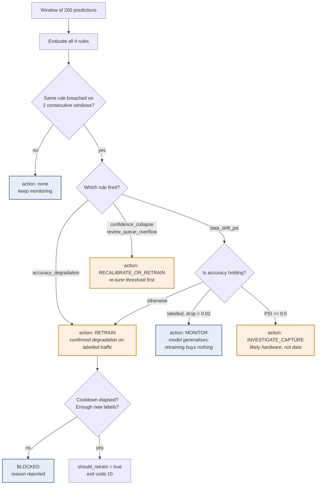

# Retraining Trigger Design

**Deliverable 4 · Module M5 · PCAM\* ZC412 Mini-Project (Flavor B)**

Implementation: [`src/defectvision/monitoring/retrain_trigger.py`](../src/defectvision/monitoring/retrain_trigger.py)
Configuration: `retraining:` in [`params.yaml`](../params.yaml)
Live output: `reports/retraining_decision.json`

---

## 1. The question this design answers

The naive trigger is one line:

```python
if psi > 0.25:
    retrain()
```

It is wrong in four separate ways, and each way costs something real. This
document states the failure, then the mechanism that prevents it.

| # | Failure of the naive rule | Cost when it happens | Mechanism |
| --- | --- | --- | --- |
| 1 | Fires on a single noisy window | Retrains on a shift change or an odd batch | **Persistence** |
| 2 | Fires without labelled data | Retrains on old data + noise; strictly worse than nothing | **Label sufficiency** |
| 3 | Fires again immediately after a retrain | Infinite loop burning compute, churning production models | **Cooldown** |
| 4 | Treats every signal as "retrain" | Retrains when the real fix was a threshold, or a lens wipe | **Severity routing** |

---

## 2. Signals

Three tiers, ordered by how early they are available. This ordering is the
point: the signal that matters most arrives last, so the earlier ones exist to
buy warning time.

### Tier 1 — Data drift *(available immediately, no labels)*

Seven image statistics are computed at request time and logged with every
prediction. Each maps to a physical failure on the line:

| statistic | what a shift means |
| --- | --- |
| `mean_intensity` | line lighting brighter or dimmer |
| `std_intensity` | contrast collapsed — fogged lens, diffuser change |
| `p05_intensity` / `p95_intensity` | shadows crushed / highlights blown |
| `edge_density` | part geometry changed, or the image went soft |
| `laplacian_var` | focus drift (the classic blur detector) |
| `entropy` | information content dropped — occlusion, washout |

Compared against the frozen training baseline with **PSI** (primary),
**KS** (corroboration) and **chi-square** (categorical mix).

### Tier 2 — Model behaviour *(available immediately, no labels)*

- `mean_confidence` — a model losing grip on a shifted distribution gets less
  certain *before* anyone can measure that it is wrong.
- `predicted_defect_rate` — a sudden change in the flagged fraction is either a
  real process change or a model problem; both need a human.
- `review_rate` — share of traffic landing in the low-confidence band. Also an
  operational signal in its own right: the review queue is staffed, and it
  overflowing is a business problem regardless of accuracy.

### Tier 3 — Measured performance *(needs labels; arrives hours to days later)*

`accuracy`, `recall`, `f1` over rows where ground truth has been attached via
`POST /feedback`. This is the ground truth of monitoring — and the reason
Tiers 1 and 2 exist is that waiting for it means waiting through the outage.

---

## 3. Rules

From `params.yaml`:

```yaml
retraining:
  window_size: 200
  consecutive_windows: 2
  cooldown_hours: 24
  min_new_labeled_samples: 300
  rules:
    - { name: data_drift_psi,        metric: psi_max,              op: ">=", threshold: 0.25, severity: high }
    - { name: confidence_collapse,   metric: mean_confidence_drop, op: ">=", threshold: 0.08, severity: medium }
    - { name: accuracy_degradation,  metric: accuracy_drop,        op: ">=", threshold: 0.05, severity: high }
    - { name: review_queue_overflow, metric: review_rate,          op: ">=", threshold: 0.20, severity: medium }
```

### Why these thresholds

**`psi_max >= 0.25`** — the conventional PSI band for "significant population
shift" (below 0.10 stable, 0.10–0.25 moderate). Not an arbitrary number: it is
the industry convention these bands were calibrated against, and it is
sample-size independent, which is what makes it safe as a fixed threshold.

**`accuracy_drop >= 0.05`** — set against the promotion gate. A model is
promoted at ≥ 0.85 F1; a 5-point absolute fall from a ~0.99 baseline lands near
that floor. In other words, the retraining trigger fires at roughly the point
where the model would no longer pass the bar that let it ship.

**`mean_confidence_drop >= 0.08`** — a leading indicator, so deliberately looser
than the accuracy rule and routed to a *softer* action. It is allowed to be
noisier because it never triggers a retrain on its own.

**`review_rate >= 0.20`** — a capacity threshold, not a statistical one. Above
roughly one in five parts, manual review stops being an exception process and
the automation has stopped paying for itself.

**`consecutive_windows: 2`** at `window_size: 200` — a breach must survive 400
consecutive parts. Long enough to outlast a single odd batch or shift change,
short enough to react within a shift.

**`cooldown_hours: 24`** — one full production day, so a retrain is observed
across all three shifts before another can be considered.

**`min_new_labeled_samples: 300`** — below this, "retraining" means refitting on
essentially the old dataset. The trigger reports this as a **blocker**, which is
itself the actionable output: *go collect labels*.

---

## 4. Decision flow



### The two branches that matter most

**Drift with intact accuracy → `monitor`, not `retrain`.** If PSI is high but
labelled accuracy has barely moved, the model *generalises* to the new regime.
Retraining spends compute and introduces deployment risk to fix a problem that
does not exist. This is the single most common false positive in drift
monitoring, and the rule that prevents it is worth more than any threshold
tuning.

**Very large drift → `investigate_capture`, not `retrain`.** A PSI above 0.5 on
image statistics is rarely the parts changing; it is a lamp, a lens, or a camera
pose. Retraining on data from a broken capture rig **bakes the fault into the
model** — and then the fix, once someone repairs the camera, is a *second*
retrain. Inspect the hardware first.

---

## 5. Actions

| action | meaning | next step |
| --- | --- | --- |
| `none` | No rule fired | — |
| `monitor` | Inputs shifted, accuracy intact | Keep collecting labels; re-check next window |
| `recalibrate_or_retrain` | Less confident, degradation unconfirmed | Re-tune the operating threshold on recent labelled data; escalate if the review rate stays high |
| `investigate_capture` | Shift too large to be the parts | Inspect lamp, lens, focus, camera pose before touching the model |
| `retrain` | Confirmed or strongly implied degradation | Full retraining workflow below |

Only `retrain` sets `should_retrain: true` and exit code **10**.

---

## 6. Retraining workflow

```bash
python -m defectvision.cli data
```

```bash
python -m defectvision.cli train --all
```

```bash
python -m defectvision.cli compare
```

```bash
python -m defectvision.cli reference-stats
```

```bash
python -c "from defectvision.monitoring.retrain_trigger import record_retrain; record_retrain('drift')"
```

Four properties of this workflow are load-bearing:

1. **`compare` re-applies the promotion gates.** A retrained model is a
   *candidate*, not automatically the new production model. A retrain that
   produced something worse is caught here and nothing is promoted.
2. **`reference-stats` re-baselines monitoring.** Skipping this leaves the new
   model measured against the old distribution, so it would appear to be
   drifting from the moment it shipped.
3. **`record_retrain` starts the cooldown clock**, and it persists to disk so
   the cooldown survives a process restart.
4. **The old bundle is not deleted.** `models/candidates/` retains every arm and
   MLflow retains every run, so rollback is a file copy.

---

## 7. Human in the loop

Two mechanisms, both required by M5 / CS10:

**Review band.** Predictions in `serving.review_band` (default 0.35–0.65) are
returned with `decision: "human_review"` rather than an auto-action. A
probability just past the threshold is a coin-flip dressed as a decision, and
the review rate is itself a monitored signal.

**Feedback endpoint.** `POST /feedback` attaches ground truth to a past
prediction by `request_id`. This is how Tier-3 signals ever become available,
and it models the real timing: labels arrive from teardown, rework or customer
returns, long after the prediction. The schema treats delayed labels as normal
rather than as an afterthought.

---

## 8. Known limitations

Stated because the design should be judged on what it does *not* cover as much
as on what it does.

- **Label bias.** Ground truth is likeliest to arrive for parts a human already
  reviewed — i.e. the low-confidence band. Tier-3 accuracy is therefore measured
  on a non-random sample and is pessimistic. A production system would need
  stratified sampling for labelling.
- **No automatic rollback.** A promoted model that degrades needs a human to run
  `package --model <previous>`. Automating it needs a canary deployment with
  live traffic splitting, which is beyond this project's scope.
- **Single global threshold.** One operating point is used for all product
  variants. A real line with several SKUs would want per-variant thresholds.
- **Cold-start on `min_new_labeled_samples`.** A brand-new deployment has no
  labels, so Tier-3 rules cannot fire for the first days. Tiers 1 and 2 are the
  only cover during that window — which is precisely why they were built.
